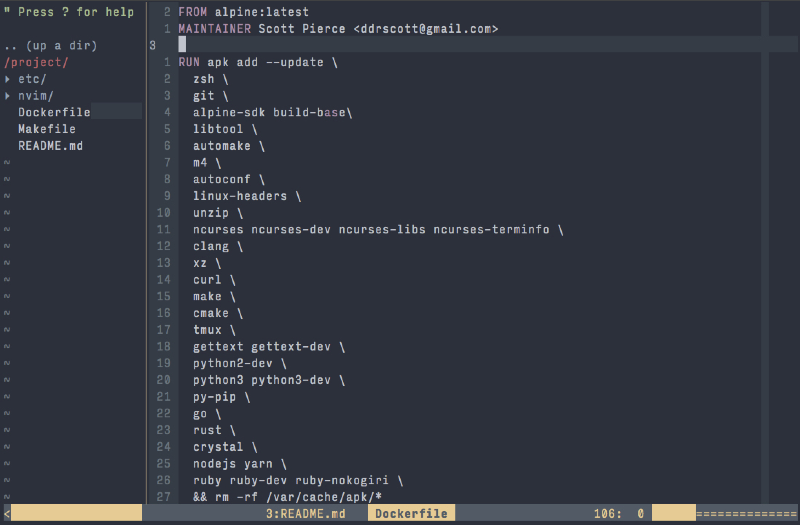

# Docker + Vim = DrVim

A dockerized image of my typical development environment.



## Language Support
- [x] Python
- [x] Javascript/Typescript
- [ ] Ruby

## Built for you!

The default container user is `drvim`.
You'll want to make a build for your development user so the container user/group id matches the you
local user/group id.

```sh
# Clone this repo
git clone https://github.com/ddrscott/drvim.git

# Go into directory
cd drvim

# Build it for yourself
make me

# Run it
docker run -it --rm drvim
```

## Run it with your project
```sh

# Go to your project
cd /path/to/project

# Run the container
# By default, we start in TMUX.
docker run -it --rm -v $(pwd):/project -w /project drvim
#           ^    ^   ^                  ^            ^
#           |    |   |                  |            |
#           |    |   |                  |            + image name
#           |    |   |                  + start in /project
#           |    |   + map current directory to /project
#           |    + remove container after exit
#           + interactive terminal
#          

# Make an alias:
alias dv='docker run -it --rm -v $(pwd):/project -v ~/.ssh:/home/$(whoami)/.ssh -w /project drvim'

# To directly to NeoVim instead:
alias dv='docker run -it --rm -v $(pwd):/project -v ~/.ssh:/home/$(whoami)/.ssh -w /project drvim zsh -il -c nvim'
```

See the `Makefile` for how your user is passed through to docker build.
